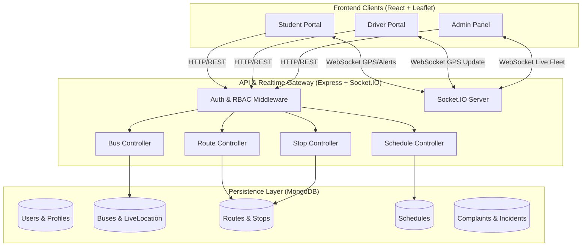

# CampusMove AI — Technical Architecture

## 1. Technology Stack

### Frontend
- **Framework**: React 18 with Vite
- **Styling**: Tailwind CSS with custom status and brand themes
- **Mapping**: OpenStreetMap tiles via Leaflet & React-Leaflet
- **Icons**: Lucide React
- **Routing & State**: React Router v6, Axios with Bearer token interceptor, React Context API

### Backend
- **Runtime**: Node.js (v20+) with Express
- **Realtime**: Socket.IO (WebSockets)
- **Database**: MongoDB with Mongoose ODM (supports both local/remote MongoDB Atlas & auto in-memory fallback for zero-configuration testing)
- **Security & Auth**: JWT (JSON Web Tokens), bcryptjs password hashing, CORS, Helmet/Morgan logging

### AI & Agents (Phase 4 Foundation)
- Tool-calling LLM integration (Gemini / OpenAI compatible)
- Built-in deterministic tool callers: `get_bus_locations`, `get_routes`, `get_schedule`, `get_stop_information`, `calculate_eta`, `check_delays`, `find_alternative_route`, `create_incident`.

---

## 2. System Architecture

---

## 3. Data Entities & Schema Definitions

### 3.1 User (`User.js`)
- `_id`: ObjectId
- `name`: String
- `email`: String (unique, index)
- `passwordHash`: String
- `role`: Enum (`student`, `driver`, `admin`)
- `phone`: String
- `createdAt`, `updatedAt`: Date

### 3.2 Stop (`Stop.js`)
- `_id`: ObjectId
- `name`: String (e.g., "Hostel 3", "Block C", "Central Library")
- `code`: String (e.g., "H3", "BLK-C", "LIB")
- `coordinates`: `{ lat: Number, lng: Number }`
- `campusZone`: String (e.g., "North Campus", "Academic Zone", "Hostels")
- `amenities`: `[String]` (e.g., "Covered Shelter", "Seating", "Lighting")
- `orderIndex`: Number

### 3.3 Route (`Route.js`)
- `_id`: ObjectId
- `name`: String (e.g., "North-South Campus Express")
- `code`: String (e.g., "R-101")
- `color`: String (HEX color for map polyline rendering, e.g., `#2563eb`)
- `description`: String
- `stops`: Array of `{ stopId: ObjectId, sequence: Number, distanceFromStartKm: Number, estimatedMinutesFromStart: Number }`
- `pathCoordinates`: Array of `[lat, lng]`
- `active`: Boolean

### 3.4 Bus (`Bus.js`)
- `_id`: ObjectId
- `busNumber`: String (e.g., "Bus 12")
- `plateNumber`: String (e.g., "KA-01-EXP-1012")
- `capacity`: Number (e.g., 45)
- `status`: Enum (`active`, `delayed`, `breakdown`, `out_of_service`)
- `currentDriverId`: ObjectId (Ref: User)
- `currentRouteId`: ObjectId (Ref: Route)
- `lastKnownLocation`: `{ lat: Number, lng: Number, speed: Number, heading: Number, updatedAt: Date }`

### 3.5 Schedule (`Schedule.js`)
- `_id`: ObjectId
- `routeId`: ObjectId (Ref: Route)
- `busId`: ObjectId (Ref: Bus)
- `departureTime`: String (24h format, e.g., "08:30")
- `daysOfWeek`: `[Number]` (1=Monday ... 7=Sunday)
- `direction`: Enum (`outbound`, `inbound`, `loop`)
- `active`: Boolean

---

## 4. REST API Contracts

### Authentication (`/api/auth`)
- `POST /api/auth/register` — Register student/driver/admin
- `POST /api/auth/login` — Authenticate and receive JWT token + user profile
- `GET /api/auth/me` — Retrieve current authenticated session

### Fleet Management (`/api/buses`)
- `GET /api/buses` — List all buses with populated driver and route info
- `GET /api/buses/:id` — Get bus by ID
- `POST /api/buses` — Create new bus (Admin only)
- `PUT /api/buses/:id` — Update bus details / status (Admin or assigned Driver)
- `DELETE /api/buses/:id` — Remove bus (Admin only)

### Route Management (`/api/routes`)
- `GET /api/routes` — List all routes with stops
- `GET /api/routes/:id` — Get single route details with ordered stop sequence
- `POST /api/routes` — Create route (Admin only)
- `PUT /api/routes/:id` — Update route (Admin only)
- `DELETE /api/routes/:id` — Delete route (Admin only)

### Stop Management (`/api/stops`)
- `GET /api/stops` — List all campus stops
- `GET /api/stops/:id` — Get stop details
- `POST /api/stops` — Create stop (Admin only)
- `PUT /api/stops/:id` — Update stop (Admin only)
- `DELETE /api/stops/:id` — Delete stop (Admin only)

### Schedule Management (`/api/schedules`)
- `GET /api/schedules` — List schedules (filterable by route or bus)
- `POST /api/schedules` — Create schedule (Admin only)
- `PUT /api/schedules/:id` — Update schedule (Admin only)
- `DELETE /api/schedules/:id` — Delete schedule (Admin only)
